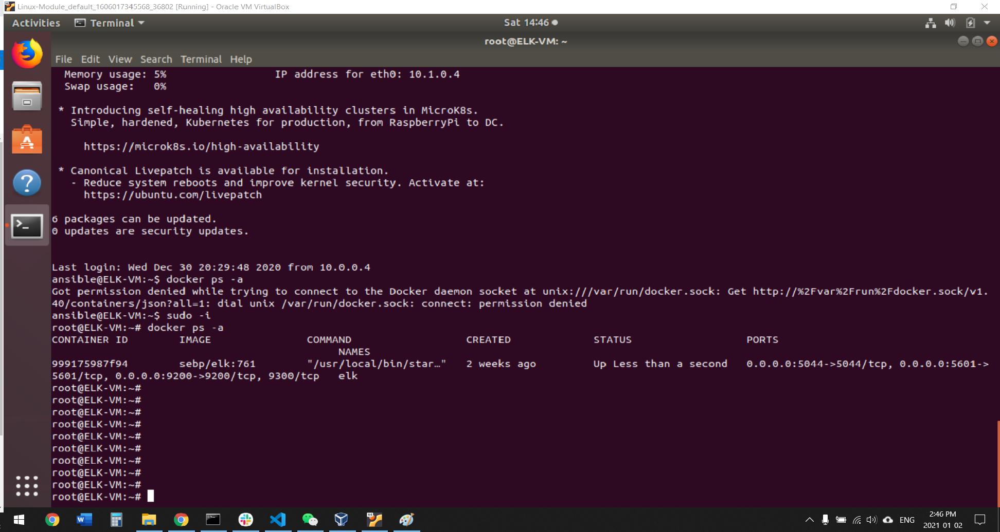

## Automated ELK Stack Deployment

The files in this repository were used to configure the network depicted below.

These files have been tested and used to generate a live ELK deployment on Azure. They can be used to either recreate the entire deployment pictured above. Alternatively, select portions of the yml file may be used to install only certain pieces of it, such as Filebeat.

  [Filebeat Configuration File ](Files/filebeat-playbook.yml).

  [Metricbeat Configuration File ](Files/metricbeat-playbook.yml).

This document contains the following details:
- Description of the Topology
- Access Policies
- ELK Configuration
  - Beats in Use
  - Machines Being Monitored
- How to Use the Ansible Build

### Description of the Topology

The main purpose of this network is to expose a load-balanced and monitored instance of DVWA, the D*mn Vulnerable Web Application.

Load balancing ensures that the application will be highly available, in addition to restricting traffic to the network.
A **load balancer** is a device that acts as a reverse proxy and distributes network or application traffic across a number of servers. Load balancers are used to increase capacity (concurrent users) and reliability of applications.

**Jump boxes** are usually used for a system tool that needs to connect directly to the devices on the security zone in question.When a jump box is used, its hidden benefit is that any tools in place for the SAN system are maintained on that single system. Therefore, when an update to the SAN management software is available, only a single system requires the update.

Integrating an ELK server allows users to easily monitor the vulnerable VMs for changes to the files and system usage.
- **Filebeat** collects data about the file system.

- **Metricbeat** collects machine metrics, such as uptime.

The configuration details of each machine may be found below.

| Name     | Function   | IP Address | Operating System |
|----------|------------|------------|------------------|
| Jump Box | Gateway    | 10.0.0.4   | Linux            |
| Web-1    | Web Server | 10.0.0.5   | Linux            |
| Web-2    | Web Server | 10.0.0.6   | Linux            |
| ELK      | ELK Server | 10.1.0.4   | Linux            |

### Access Policies

The machines on the internal network are not exposed to the public Internet. 

Only the whitelisted machine can accept connections from the Internet. Access to this machine is only allowed from the following IP addresses:
162.210.192.157

Machines within the network can only be accessed by SSH.
From my personal worksation, IP address:162.210.192.157

A summary of the access policies in place can be found in the table below.

| Name          | Publicly Accessible | Allowed IP Addresses |
|---------------|---------------------|----------------------|
| Jump Box      | Yes                 | SSH                  |
| Web-1         | No                  | SSH                  |
| Web-2         | No                  | SSH                  |
| ELK           | Yes                 | 162.210.192.157      |
| Load Balancer | Yes                 | 162.210.192.157      |

### Elk Configuration

Ansible was used to automate configuration of the ELK machine. No configuration was performed manually, which is advantageous because...

Consistent development experience for you and your team
Decouples the Ansible environment from the target environment
Portability reduces management overhead
Immutable manages the mutable

The playbook implements the following tasks:
- Install docker
- Download required application from docker hub
- Configure application based on palybook.

The following screenshot displays the result of running `docker ps` after successfully configuring the ELK instance.

### Target Machines & Beats
This ELK server is configured to monitor the following machines:

Web-1:10.0.0.5

Web-2:10.0.0.6

We have installed the following Beats on these machines:

Web-1:10.0.0.5

Web-2:10.0.0.6

These Beats allow us to collect the following information from each machine:

- **Filebeat** collects data about the file system.

- **Metricbeat** collects machine metrics, such as uptime.

- **Packetbeat** collects Network protocols like HTTP and keep a pulse on application latency and errors, response times, SLA performance, user access patterns and trends

- **Winlogbeat** collects Windows machine event logs.

- **Auditbeat** collect Linux audit framework data and monitor the integrity of your files

- **Heartbeat** collects and monitor services for their availability with active probing.

- **Functionbeat** Deploy as a function in your cloud provider’s Function-as-a-Service (FaaS) platform to collect, ship, and monitor data from your cloud services.

### Using the Playbook
In order to use the playbook, you will need to have an Ansible control node already configured. Assuming you have such a control node provisioned: 

SSH into the control node and follow the steps below:
- Copy the yml file to ansible docker.
- Update the hosts file to include the target machine such as Webserver or ELK server
- Run the playbook, and navigate to target machine to check that the installation worked as expected.

- _Which URL do you navigate to in order to check that the ELK server is running?

URL: http://(ELK public IP address):5601

_As a **Bonus**, provide the specific commands the user will need to run to download the playbook, update the files, etc._